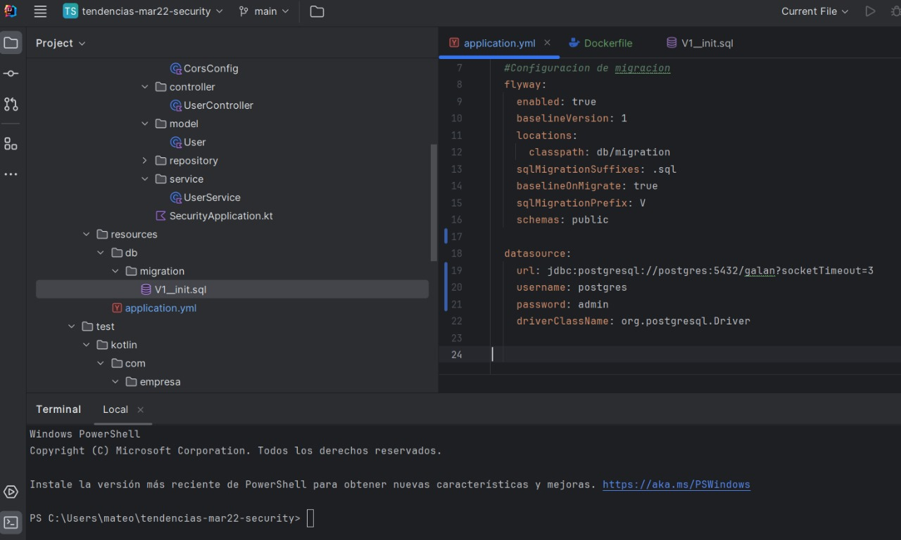
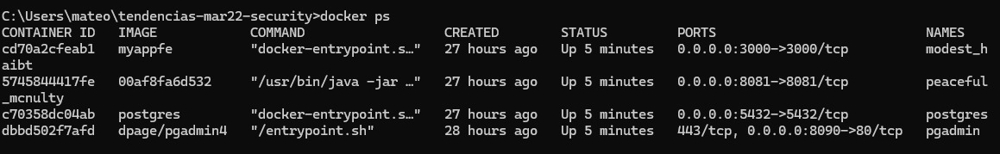

---

##
**Practica de una aplicación backend con PostgreSQL y Spring Boot utilizando Docker Mateo Galan**

---

## Tiempo de duración
Esta práctica tuvo una duración aproximada de **95 minutos**.

---

## Fundamentos
### PostgreSQL
PostgreSQL es un sistema de gestión de bases de datos relacional de código abierto reconocido por su fiabilidad, escalabilidad y flexibilidad. Admite tanto datos relacionales como no relacionales y es ampliamente utilizado en aplicaciones empresariales debido a su capacidad para manejar grandes volúmenes de datos con alto rendimiento.

### Spring Boot
Spring Boot es un framework basado en Java diseñado para facilitar el desarrollo de aplicaciones web y backend. Su principal fortaleza radica en su enfoque para crear aplicaciones listas para producción con mínima configuración, integrándose fácilmente con bases de datos como PostgreSQL.

### Docker
Docker es una herramienta de contenedorización que permite empaquetar aplicaciones y sus dependencias en contenedores aislados. Esto asegura que las aplicaciones sean portables y puedan ejecutarse de manera consistente en cualquier entorno.

---

## Conocimientos previos
Para realizar esta práctica, fue necesario tener conocimientos básicos de:

- Comandos de Docker, como `docker run`, `docker network`.
---

## Objetivos
1. Desplegar una base de datos PostgreSQL en un contenedor Docker.
2. Configurar y ejecutar una aplicación Spring Boot que se conecte a PostgreSQL.
3. Crear una red en Docker para permitir la comunicación entre ambos contenedores.
4. Probar el correcto funcionamiento del backend accediendo a **"localhost:8081/users"**

---

## Equipo necesario
- Laptop o computadora 
- Conexión a Internet para descargar las imágenes necesarias.

---

## Material de apoyo
- Documentación oficial de Docker: [https://docs.docker.com/](https://docs.docker.com/)

## Procedimiento

**Paso 1:** Acceder a Docker Desktop y ejecutar los contenedores de postgres y pgAdmin

                                                                                               Ñ

**Paso 2:** Crear la red y conectarla a los contenedores:

                                                                                             

**Paso 3:**  Crear la base de datos para el proyecto:

                                                                                             

**Paso 4:** Clonar y abrir el poryecto Backend de SpringBoot 

                                                                                                         

**Paso 5:** Modificar los datos del "application.yml"  con los datos de conexión a la base de datos del servidor postgres

     

                                                                                             

**Paso 6:** Generar el archivo jar(artefacto) usando un contenedor de maven
 
    

                                                                                                        

**Paso 7:**Crear el archivo Dockerfile dentro de la carpeta principal del proyecto:

 

                                                                                                                        
**Paso 8:** Crear imagen con la app de springboot

            

                                                                                              

**Paso 9:** Crear el contenedor a partir de la imagen usando la red conectada a los contenedores :

                                                                                             

**Paso 10:** Porbar el funcionamiento ejecutando "localhost:8081/users":

## Resultados esperados 
- Los contenedores de PostgreSQL y pgAdmin deben estar creados, en ejecución y accesibles desde Docker Desktop.

- La red de Docker debe estar configurada correctamente, permitiendo la comunicación entre los contenedores de PostgreSQL y pgAdmin.

- El panel de administración de pgAdmin debe ser accesible en el puerto 8090, mostrando la interfaz y permitiendo gestionar bases de datos.

- Se debe poder conectar a PostgreSQL desde pgAdmin, validado por la creación de una base de datos y una tabla, confirmando que la configuración de la red es exitosa.

- La API de Spring Boot debe estar corriendo correctamente y ser accesible desde localhost:8081/users, mostrando los usuarios de la base de datos o confirmando su correcto funcionamiento.

## Bibliografia 
PostgreSQL Global Development Group. (n.d.). PostgreSQL: The world's most advanced open source relational database. Retrieved November 25, 2024, from https://www.postgresql.org/

Spring Boot
Pivotal Software, Inc. (n.d.). Spring Boot: Framework for building production-ready applications. Retrieved November 25, 2024, from https://spring.io/projects/spring-boot

Docker
Docker Inc. (n.d.). Docker: Empowering app development for developers. Retrieved November 25, 2024, from https://www.docker.com/